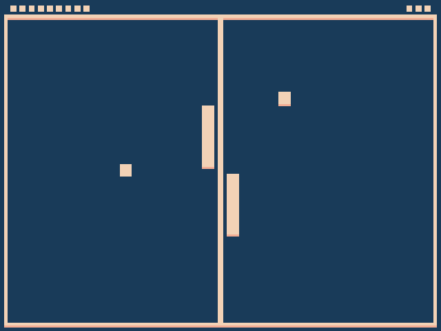

# Mirror Pong

Author: Wenlin Mao

Design: Welcome to a mirrored world. All your actions will mirror reflected in the other deminsion. 
You should accompany your mirrored self to guard the central wall 
from balls flying acrossed the two dimensions. Balls will change their speed as well as direction
as they acrossed the boundary of two dimensions. 

Screen Shot:

How To Play:

Player can control the left paddle. Right paddle will mirror left paddle's behavior. Player initially has 
10 hp and the score will increase every two seconds. Everytime, any of the two balls hit the center wall,
the hp will be deducted. The goal of this game is to survival as long as possible so that your score will be higher. 
Balls will fly off screen and appears in the other side of the screen, with the mirrored behavior in addition to some
random changes in speed. 

This game was built with [NEST](NEST.md).
